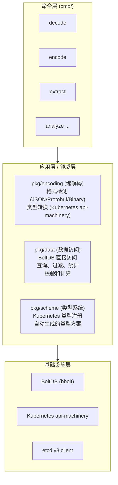
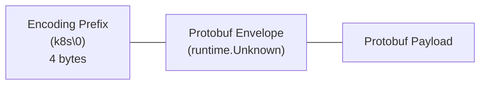
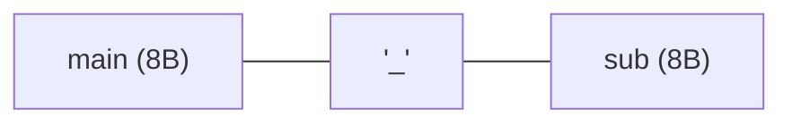
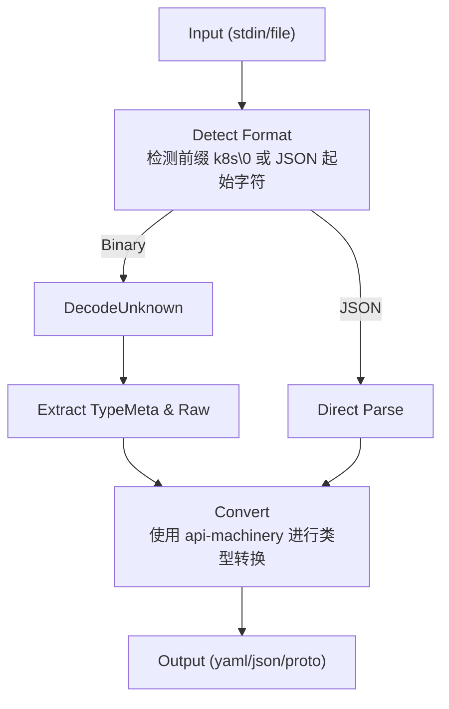
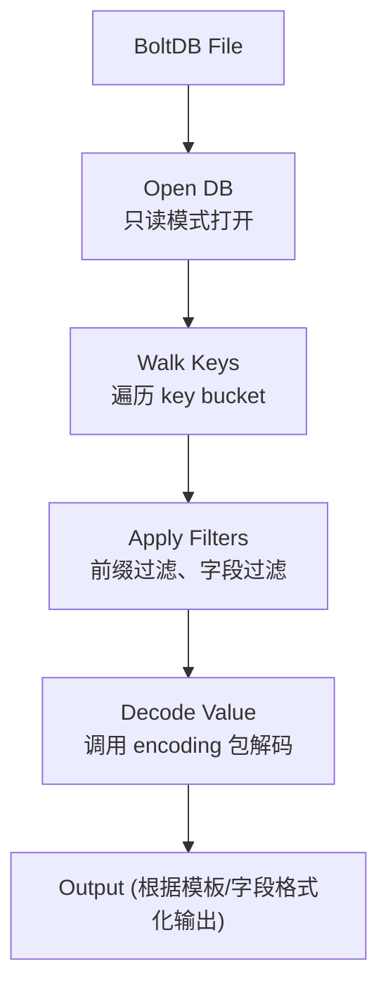
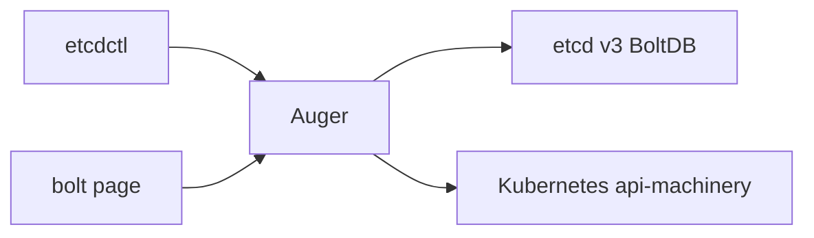

# Auger 系统设计文档

## 1. 项目概述

### 1.1 项目背景

Auger 是一个用于直接访问 Kubernetes 存储在 etcd 中的数据对象的工具。随着 Kubernetes 1.6+ 版本将数据以二进制存储格式存储在 etcd 中（不再是之前的 JSON 格式），直接查看和操作这些数据变得困难。Auger 解决了这个问题，提供了编解码、数据提取和分析功能。

### 1.2 核心功能

1. **编解码功能**: 将 Kubernetes 二进制存储数据解码为 YAML、JSON 或 Protobuf 格式，或将 YAML/JSON 编码为二进制存储格式
2. **数据提取**: 直接从 BoltDB 文件（etcd 的持久化存储）提取数据
3. **数据完整性校验**: 计算 etcd 数据校验和，检测数据不一致
4. **数据分析**: 分析 etcd 数据，生成统计信息
5. **数据恢复**: 从指定修订版本恢复数据，或从另一个数据库恢复

### 1.3 目标用户

- Kubernetes 开发者和运维人员
- etcd 开发者
- 需要直接访问 etcd 数据的集群管理员

## 2. 系统架构

### 2.1 整体架构



### 2.2 模块职责

| 模块 | 职责 | 关键文件 |
|------|------|----------|
| cmd | CLI 命令实现 | decode.go, encode.go, extract.go |
| pkg/encoding | 数据格式转换 | encoding.go |
| pkg/data | BoltDB 数据访问 | data.go |
| pkg/scheme | K8s 类型注册 | scheme.go |
| pkg/client | etcd 客户端 | client.go |

## 3. 核心概念

### 3.1 存储格式

Kubernetes 在 etcd 中的数据存储格式经历了演变：

**Kubernetes 1.5 及之前**: JSON 格式直接存储
**Kubernetes 1.6+**: 二进制存储格式

二进制格式结构：


### 3.2 媒体类型

系统支持以下媒体类型：

| 简称 | 媒体类型 | 说明 |
|------|----------|------|
| yaml | application/yaml | YAML 格式 |
| json | application/json | JSON 格式 |
| proto | application/vnd.kubernetes.protobuf | Protobuf 格式 |
| - | application/vnd.kubernetes.storagebinary | 存储二进制格式 |

### 3.3 etcd 数据模型

etcd v3 使用 BoltDB 作为后端存储，数据模型如下：

- **key bucket**: 存储实际的 key-value 数据
- **meta bucket**: 存储元数据（如已完成的压缩修订版本）

Key 的编码格式（revision）：


## 4. 数据流

### 4.1 解码流程



### 4.2 提取流程



## 5. 接口设计

### 5.1 命令接口

```go
// 命令模式使用 cobra 框架
type Command struct {
    Use     string
    Short   string
    Long    string
    Example string
    RunE    func(cmd *cobra.Command, args []string) error
}
```

### 5.2 编解码接口

```go
// 核心编解码函数
func DetectAndConvert(
    codecs serializer.CodecFactory,
    outMediaType string,
    in []byte
) ([]byte, *runtime.TypeMeta, error)
```

### 5.3 数据访问接口

```go
// Filter 接口用于数据过滤
type Filter interface {
    Accept(ks *KeySummary) (bool, error)
}

// 数据查询函数
func ListKeySummaries(
    codecs serializer.CodecFactory,
    filename string,
    filters []Filter,
    proj *KeySummaryProjection,
    revision int64
) ([]*KeySummary, error)
```

## 6. 部署与运行

### 6.1 构建

```bash
make build    # 构建到 build/auger
make test     # 运行测试
make verify   # 代码质量检查
```

### 6.2 运行要求

- 使用 `extract` 命令时需要停止 etcd（因为需要获取 BoltDB 文件锁）
- 支持 etcd v3 数据格式
- 需要读取 etcd 数据文件的权限

## 7. 安全考虑

1. **文件权限**: 直接访问 etcd 数据文件需要适当的文件系统权限
2. **数据完整性**: 提供校验和功能用于检测数据损坏
3. **只读访问**: 数据访问层默认使用只读模式打开 BoltDB

## 8. 扩展性设计

### 8.1 类型系统扩展

`pkg/scheme/scheme.go` 是自动生成的，通过 `hack/gen_scheme.sh` 脚本可以更新支持的 Kubernetes API 版本。

### 8.2 过滤系统扩展

Filter 接口允许添加新的过滤方式：

```go
type Filter interface {
    Accept(ks *KeySummary) (bool, error)
}
```

### 8.3 输出格式扩展

通过添加新的媒体类型支持可以扩展输出格式。

## 9. 与其他组件的关系



## 10. 总结

Auger 采用分层架构设计，将命令层、应用层和基础设施层清晰分离。核心设计原则包括：

1. **单一职责**: 每个模块负责特定功能领域
2. **接口隔离**: 通过接口定义模块间契约
3. **可扩展性**: 支持类型、过滤器和输出格式的扩展
4. **容错性**: 提供数据校验和恢复机制
